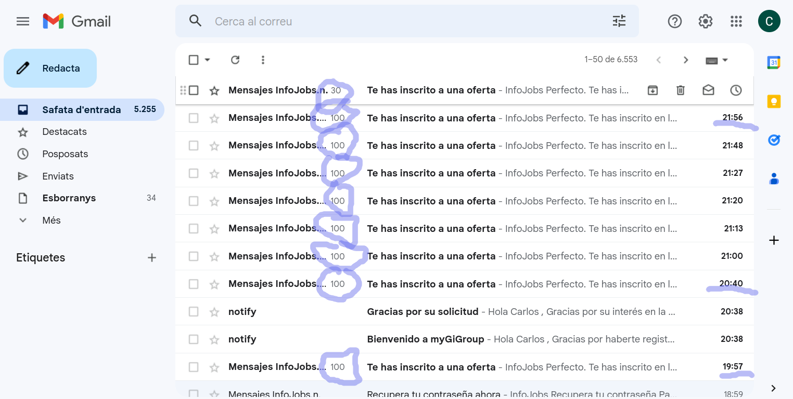
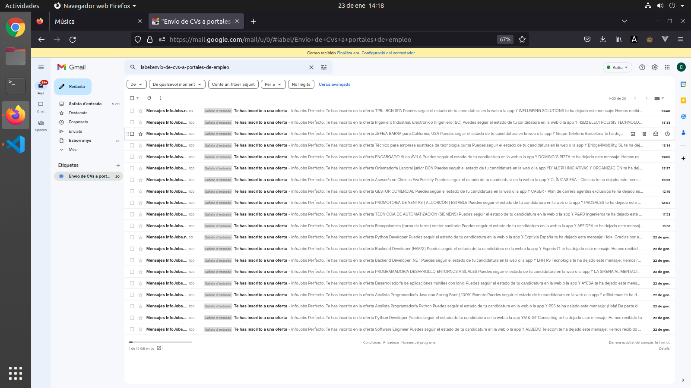

# infojobs-envio-automatico-de-cv

Script de envío automático de CV en InfoJobs, plataforma de empleo nº1 en España con sede en países nórdicos y comandada por el holding empresarial Schibsted.

## Uso

**1. Instalar `Greasemonkey` o `Tampermonkey` en tu navegador**

Nada que explicar, si sabes lo que te estás haciendo.

**2. Agrega el script a la extensión**

El script es el que está en `script-greasemonkey.js`. Cambia los textos que rellenarán los cuestionarios, si quieres.

**3. Visita Infojobs**

Hecho esto, cuando entres en Infojobs, el `Greasemonkey` se encargará de ejecutar los scripts adecuados en cada página. La explicación del script está entre comentarios.

## Testimonio

Esta es la bandeja de entrada del Gmail después de 2 horas de envío de CVs:

A la mañana siguiente, seguí enviando CVs. Casi 2.000 CVs enviados a Infojobs:

## Conclusión

No dan. Simplemente, no dan. Prefieren tener gente loca. Entre la Ley y el Libre Mercado, estoy en pelotas.

Bueno, la conclusión no es esa exactamente. La conclusión es que sois robots, y ahora lo sabemos todos.